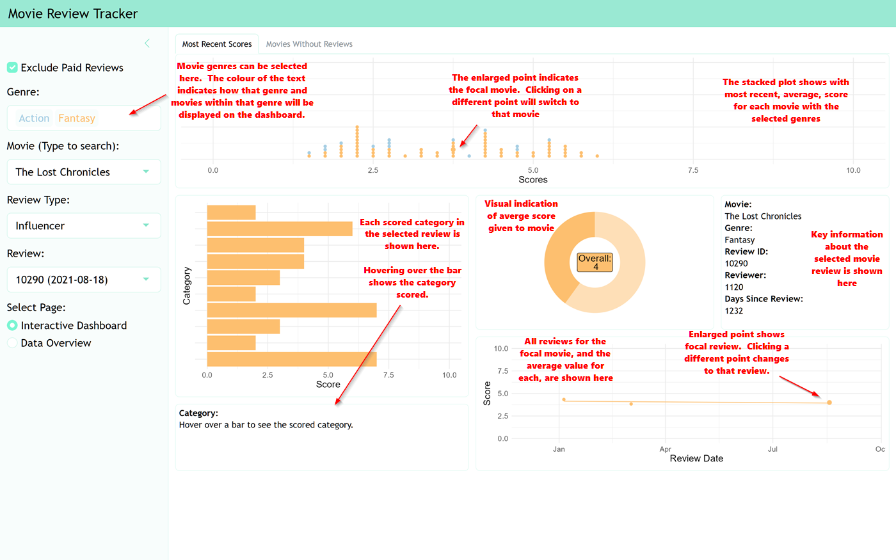
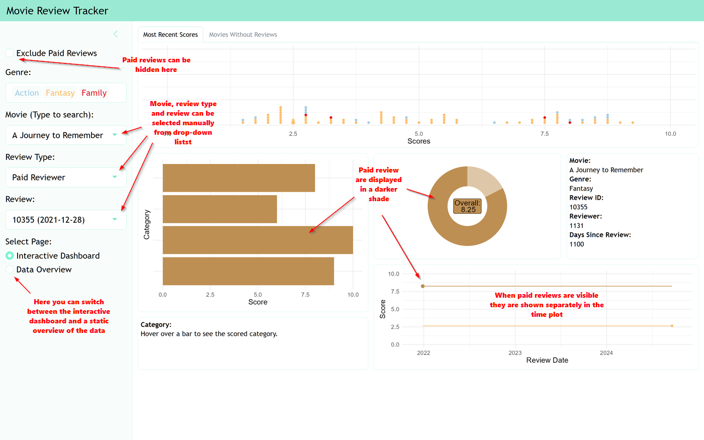
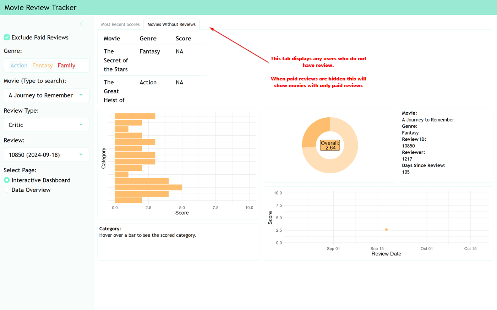
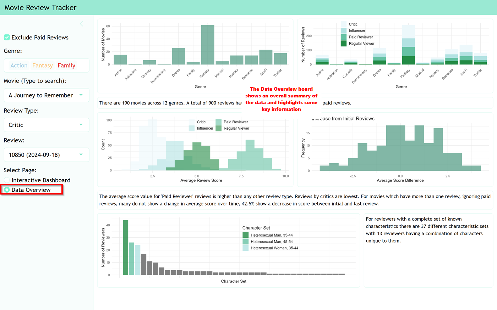

# 🌟 Example R Shiny Dashboard

This was originally a technical assignment as part of a job application process. I wanted to retain it as an example of my work, so I have simulated a fictional alternative dataset that fits the structure the dashboard requires while bearing little resemblance to the original data. (I did get offered the job, but unfortunately, it wasn't a good match for my circumstances at the time.)

The data is completely fictional and designed to include some interesting trends, movie titles and genres were generated with assistance of AI.

## Overview

Welcome to the **Movie Review Tracker Dashboard**! This interactive web application is designed to facilitate the tracking of movie reviews. Users can filter and visualise data based on various criteria, providing valuable insights into movie reviews and how they change over time.

This dashboard serves as an example for handling movie review data. While the GitHub deployment may experience some lag, the ShinyApps deployment is much faster. Running the app locally is even quicker.

### 🌐 Live Links
- **Live App:** [ShinyApps](https://simplydch.shinyapps.io/r_shiny_dashboard_example_live/)
- **GitHub Repository:** [GitHub](https://simplydch.github.io/R_Shiny_Dashboard_Example/)

---

## Features

- **🔍 Dynamic Filtering:** Filter data by genre, movie, reviewer type, and date.
- **📊 Interactive Dashboard:** Visualise data through an engaging interface.
- **📈 Data Overview:** Access a comprehensive overview of the dataset.

---

### Design Choices
**Layout:**  
For the layout, I opted for a clean, intuitive design that allows users to easily navigate the dashboard. Key information is easily accessible and interpretable. Filtering should be a seamless process and readily available. Visualisations are simple and provide a clear overview of the data.

**Interactivity:**  
Interactivity is a core feature of the dashboard. Users can dynamically filter data based on various criteria such as movie genre, reviewer types, and dates, and they can interact with the plots to select visually interesting points. Additionally, hover effects provide contextual information without cluttering the interface.

**Maintainability:**  
To ensure maintainability, the code is well-structured and formatted consistently. Functions are clearly defined for specific tasks, making it easier to update or extend functionality in the future. The input dataset is initially processed to ensure it is valid and correctly structured for the app. I also included comments to assist future developers in understanding the codebase. CSS is used to consistently style components, making changes simple to implement. Additionally, relevant variables that are used repeatedly are set up early in the code.

**Improvements:**  
The app is overly reactive, which causes it to lag. I need more time to reduce reactivity in multiple components while maintaining functionality. I suspect the code also contains redundancies and over time I hope to streamline the app.

---

### Extensions
To enhance the dashboard further, I would consider adding the following insights or charts:

1. **Trend Analysis:** Time series charts to visualise more general trends over time. For example comparing scores within genres would help establish changes in perception .
2. **Reviewers and Movie Ratings:** More detailed comparisons between reviewers, movie genres, and scores given would likely provide unique insights, but the dataset may not be large enough to draw any conclusive findings.
3. **Demographic Breakdown:** Charts that segment data by demographics (e.g., age, sexuality) could be used to uncover insights about how specific groups perceive films differently.

---

## Technologies Used

- [R](https://www.r-project.org/) - A programming language for statistical computing.
- [Shiny](https://shiny.posit.co/) - A web application framework for R.
- [bslib](https://rstudio.github.io/bslib/) - A package for creating Bootstrap themes in R.
- [ggplot2](https://ggplot2.tidyverse.org/) - A system for declaratively creating graphics.

---

## Screenshots

### Dashboard Interface

 
 
 
 

---

## To Run the App Locally

Follow these steps to get the app running on your local machine:

1. **Clone the repository:**
    ```bash
    git clone https://github.com/simplydch/R_Shiny_Dashboard_Example.git
    cd R_Shiny_Dashboard_Example
    ```

2. **Install required packages:**
    ```r
    install.packages(c("shiny", "bslib", "RColorBrewer", "ggplot2"))
    ```

3. **Run the app:**
    ```r
    shiny::runApp()
    ```

---

## Contact

For questions, suggestions, or support, feel free to reach out:

**Developer:** DCH  
📧 Email: [simplydch@gmx.co.uk]  

---
